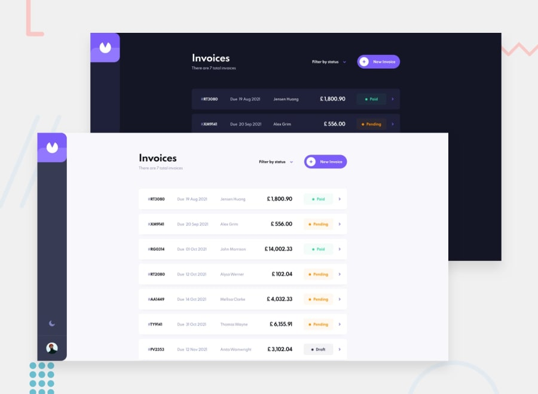

# Invoice app

## Overview

### Features

Users should be able to:

- View the optimal layout for the app depending on their device's screen size
- See hover states for all interactive elements on the page
- Create, read, update, and delete invoices
- Receive form validations when trying to create/edit an invoice
- Save draft invoices, and mark pending invoices as paid
- Filter invoices by status (draft/pending/paid)
- Toggle light and dark mode

### Link
- Live Site URL: [Live](https://invoice-sample-app.netlify.app/)

### Built with

- React
- React Router
- Redux
- Styled Components
- Framer Motion
